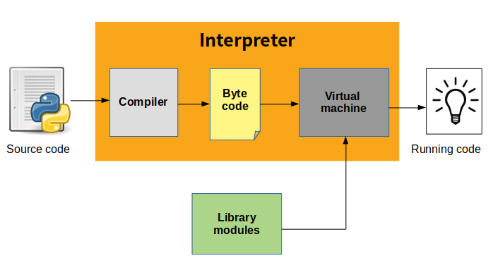

# 파이썬

## 프로그램 실행

### 바이트 코드 컴파일
파이썬 스크립트 파일은 다음과 같은 순서로 수행된다. <br/>
'바이트코드(byte code)'라고 불리는 상태로 스크립트 파일을 컴파일한다. <br/>
그리고 '가상머신(virtual machine)' 이라고 불리는 곳으로 전달한다.<br/>



파이썬은 프로그램에 대한 바이트 코드를 .pyc 확장자를 가진 파일로 저장한다.
파이썬 3.2와 그 이후 버전에서 파이썬은 소스와 같은 디렉터리 대신 소스파일들이 위치한 디렉터리에<br/>
__pycache__라는 이름의 하위 디렉터리 안에 자신의 .pyc 바이트 코드 파일을 저장한다.<br/>
그리고 각각의 .pyc 파일의 이름에는 자신을 생성한 파이썬 버전을 식별할 수 있는 정보가 포함되어 있다. <br/>

파이썬은 프로그램의 시작 속도를 최적화 하기 위해 이와 같은 바이트 코드로 저장한다. 그리고 프로그램을 다음에 다시 <br/>
실행할 때 바이트 코드가 생성된 이후에 원본 소스 코드에 변경된 내용이 없는 경우는 컴파일 단계를 생략하고 .pyc 파일을 곧바로 로드한다.

### 성능에 미치는 영향
파이썬은 보통 빌드나 'make'와 같은 단계가 없다는 것, 파이썬 코드는 작성 후 추가적인 단계 없이 바로 실행이 된다.<br/>
또 다른 하나는 파이썬의 바이트 코드가 이진 기계 코드가 아니라는 것이다. 바이트코드는 파이썬 고유의 표현 방식일 뿐이다.<br/>
PVM의 루프는 CPU 칩이 아니므로 여전히 바이트 코드를 머신 코드로 해석해야 하며, 바이트 코드 명령어들은 CPU 명령어들보다 더 많은 작업을 해야 한다.


## 파이썬의 객체 타입 소개

### 파이썬 스크립트에서는 모든 것이 객체
파이썬에서는 모든 것이 객체다. 심지어 간단한 숫자값도 객체이며, 파이썬이 제공하는 연산들 또한 객체다.<br/>

### 파이썬의 계층 구조
파이썬 프로그램은 다음과 같이 모듈, 문, 표현 그리고 객체로 분해 될 수 있다.
<ul>
    <li>프로그램은 모듈로 구성되어 있다.</li>
    <li>모듈은 문을 포함하고 있다.</li>
    <li>문은 표현을 포함하고 있다.</li>
    <li>표현은 객체를 만들고 처리한다.</li>
</ul>

### 파이썬 핵심 테이터 타입
| 객체타입 | 리터럴 / 생성 예 |
|:---|:---:|
|숫자| 1234, 3.1415, Decimal(), Fraction()|
|문자열|'span', "Bobs", b'a\x01c'|
|리스트| [1, [2, 'tree'], 4.5], list(range(10))|
|딕셔너리| {'food': 'spam', 'taste': 'yum'}, dic(hours=10)|
|튜플|(1, 'spam', 4, 'U'), tuple('spam'), namedtuple|
|파일|open('eggs.txt'), open(r'C:\ham.bin, ;bw;)|
|세트|set('abc'), {'a', 'b', 'c'}|
|다른 코어타입|부울(Boolean), types, None|
|프로그램 단윝 타입| 함수, 모듈, 클래스|
|구현 관련 타입| 컴파일된 코드, 트레이스백|

## 파이썬 데이터 타입
### 숫자
소수 부분이 없는 정수(integer), 부동 소수점(floating point), 복소수(complex), 유리수(rational), 집합(set)

```python
123 + 222
1.5 * 4
2 ** 100
```
처리 하기 너무 큰 숫자는 긴(long) 정수타입이 같은 방식으로 처리

### 문자열
문자열(String)은 텍스트 정보와 임의의 바이트 컬렉션을 저장하는데 사용 된다.<br/>
문자열은 시퀀스로써 아이템들 간의 위치적 순서를 기반으로 한 연산을 지원한다.

```python
S = 'Spam'
len(S)
S[0]
S[1]
```
변수는 값이 할당될 때 생성되며, 어떠한 타입의 객체도 할당될 수 있다. 표현식이 나타날 때는 해당 표현식의 값으로 대체 된다.<br/>
변수는 값을 사용하기 전에 먼저 값이 할당되어 있어야 한다. 파이썬에서는 시퀀스의 끝에서부터 인덱스를 거꾸로 사용할 수도 있다.<br/>
```python
S = 'Spam'
S[-1]
S[-2]
```

시퀀스는 단순한 위치 기반의 인덱싱 이외에도 슬라이싱(slicing)이라고 알려진 좀 더 일반적인 형태의 인덱싱을 지원<br/>
슬라이스는 문자열로 부터 추출하고자 하는 전체 열을 한번에 가져오는 가장 쉬운 방법<br/>
```python
S = 'Spam'
S[1:3]
S[1:]
S[0:3]
S[:3]
S[:-1]
S[:]
```

문자열은 시퀀스 처럼 더하기 기호를 사용한 연결 기능과 곱하기 기호를 사용한 반복 기능을 지원
```python
S = 'Spam'
S + 'xyz'
print(S)
S * 8
```

타입에 제약이 없으므로 파이썬 코드 연산은 객체들이 인터페이스 호환성을 제공하는 한, 많은 다른 종류의 객체에 대해서 자동으로 정상 동작한다.<br/>
이러한 다형성은 파이썬이 추구하는 중요한 개념


