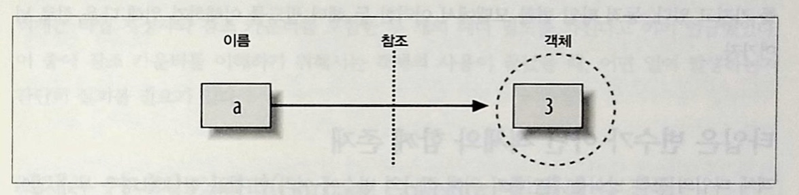

# 파이썬 동적 타입 변환
대화형 세션에 a = 3이라고 입력 했을 때 이 코드는 어떻게든 동작하지만, 파이썬은 a가 정수를 의미한다는 것을 어떻게 알 수 있을까?<br/>


## 변수, 객체,  참조

<ul>
    <li>**변수 생성 :** a와 같은 변수는 코드에서 처음으로 값이 할당될 때 생성된다.</li>
    <li>
        **변수 타입 :** 변수는 어떤 타입이나 관련된 제약 사항에 대한 정보를 갖지 않는다. 파이썬에서 타입의 개념은 이름이 아닌<br/>
        객체와 연관되어 있다. 변수는 본질적으로 일반화(generic)되어 있으며, 단순히 항상 특정 시점에서 특정 객체를 참조하고 있다.
    </li>
    <li>**변수 사용 :** 표현식에서 변수가 나타나면, 해당 변수가 현재 참조하고 있는 객체가 무엇이든 상관없이 즉시 대체 된다.</li>
</ul>
요약 하면 할당될 때 변수는 어떤 타입의 객체도 참조할 수 있으며, 변수는 참조되는 전에 할당 되어야 한다.

```python
a = 3 # 객체에 이름을 할당

# 1. 값 3을 나타내는 객체 생성
# 2. 변수 a가 아직 존재하지 않을 경우 생성
# 3. 변수 a를 새로운 객체 3으로 연결

```
변수와 객체는 서로 다른 메모리상에 저장되며, 서로는 링크에 의해 연결된다.(링크는 그림에서 포인터로 표시된다.)<br/>
변수는 객체에 항상 연결되고 다른 변수와는 연결되지 않지만, 큰 객체의 경우 다른 객체로 연결 될 수도 있다.<br/>
(예를 들어, 리스트 객체는 자신이 포함하고 있는 객체들에 대한 링크를 가질 수 있다.)


변수에서 객체로 향하는 이러한 링크를 파이썬에서 참조(reference)라고 부른다. 즉, 참조는 메모리상에서 포인터로 구현된 연결(association)의 한 종류다.<br/>

개념적으로 스크립트에서 표현식을 실행하여 새로운 값을 생성할 때마다 파이썬은 해당 값을 표현하기 위해 새로운 객체(즉, 메모리 덩어리)를 생성한다.<br/>
파이썬은 내부적으로 최적화를 하면서 작은 정수와 문자열 같은 특정 유형의 변경할 수 없는 객체들을 저장하고 재사용한다.<br/>
그러나 논리적인 관점에서 각 표현식의 결괏값은 별개의 객체이며, 별도의 메모리 공간이다.<br/>

객체는 자신의 값을 표현하기 위해 필요한 공가보다 더 많은 구조를 가지고 있다. 또한, 각 객체는 객체의 타입을 표시하는 데 사용되는 타입 지정자와 해당 객체의 <br/>
재사용 시기를 결정하기 위한 참조 카운터라는 두개의 표준 헤더 필드를 가지고 있다.<br/>

